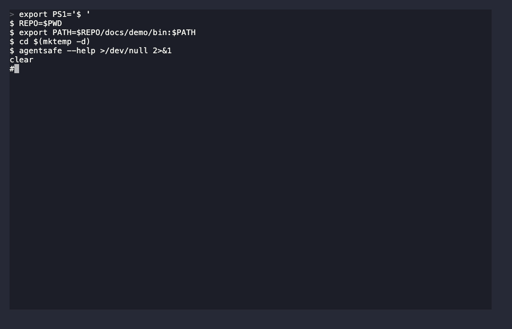

# agentsafe

Agent Safe `agentsafe` is a Python library and CLI for storing application configuration
values—API keys, access tokens, passwords, and connection strings—as KMS-backed
ciphertext. It never generates, stores, or manages encryption key material.
Every encryption and decryption operation is delegated to a customer-managed
Oracle Cloud Infrastructure (OCI) KMS key.

The PyPI distribution is named `agentconfigsafe`; Python imports and the CLI
are named `agentsafe`.

# How to use it?


## Why use it?

Applications often need sensitive configuration but should not keep it in
source control, plaintext `.env` files, or application configuration files.
`agentsafe` keeps encrypted values in project-local files — a JSON `appconfig`
store, a standard-shaped `.env` file, or both — while leaving encryption
authority with the customer's OCI KMS key and IAM policies.

Common uses include:

- API keys for LLM, SaaS, or third-party integrations used by AI agents.
- Database connection strings, webhook secrets, and service credentials.
- Teams that want their encrypted secrets and KMS settings checked into git
  and shared, so a fresh clone has everything it needs except each
  developer's own local OCI credentials.
- Setup scripts that configure a secret once, followed by runtime SDK reads.

## Security model

- Plaintext values are encrypted through OCI KMS before they reach
  `appconfig` or `.env`.
- `appconfig` and `.env` contain ciphertext envelopes and provider metadata
  only; neither ever contains plaintext values, OCI credentials, or key
  material.
- OCI KMS configuration is stored separately in the project-local
  `.agentsafe/config` file, not in `appconfig`/`.env`. Unlike ciphertext,
  these are identifiers (a key OCID, a crypto endpoint URL, a profile name)
  — safe to commit alongside the ciphertext they route to, since OCI itself
  never treats an OCID or endpoint as a secret.
- `get()` decrypts in memory only for the duration of the call (or, for
  `env.load()`, until it populates `os.environ`). Values are not otherwise
  cached by `agentsafe`.
- `list` and `env list` return names only and never call KMS Decrypt.
- `agentsafe` relies on OCI's standard profile configuration and IAM. It does
  not implement a second authentication system.
- `.env.agent` is the one place a developer types a real secret in the
  clear — it is never committed, and `agentsafe env encrypt` warns if it
  isn't gitignored. The compiled `.env` it produces is always fully
  encrypted.

Avoid placing real secrets directly in shell arguments: they can be exposed in
shell history and process listings. Prefer the hidden `set` prompt or piping
the value on stdin.

## Install

Install the OCI provider extra in the application environment:

```console
python -m pip install "agentconfigsafe[oci]"
```

You also need an OCI profile in `~/.oci/config`, a vault crypto endpoint, and
a KMS key that the profile is allowed to use for Encrypt and Decrypt.

## Quick start: CLI

Create the project-local KMS configuration. This writes OCI identifiers to
`.agentsafe/config` in the current directory; it does not create or modify
`appconfig`.

```console
agentsafe init --profile DEFAULT \
  --crypto-endpoint https://<vault>-crypto.kms.<region>.oraclecloud.com \
  --key-id <key-ocid>
agentsafe config  # displays the project KMS configuration; does not contact KMS
```

Store a value. Omitting the value opens a hidden prompt (or reads piped
stdin); the first `set` creates the local `appconfig` ciphertext store.

```console
agentsafe set OPENAI_API_KEY
agentsafe get OPENAI_API_KEY
agentsafe list
agentsafe remove OPENAI_API_KEY
```

Use `--path /path/to/appconfig` with `set`, `get`, `list`, or `remove` when a
project's ciphertext store is not in the current directory.

`.agentsafe/config` and `appconfig` are both project-local and safe to commit
to git together — a teammate who clones the repo only needs their own OCI
profile locally (see "Security model") to decrypt.

## `.env` support

A second, parallel store for teams whose other tooling (frameworks,
`docker compose`, CI systems) already auto-loads a `.env` file. It uses the
same KMS-backed encryption and the same `.agentsafe/config` settings as
`appconfig` — just persisted as `KEY=value` lines instead of JSON.

Write real values into `.env.agent` (plaintext, gitignored, never
committed), then compile it into a fully-encrypted, git-committable `.env`:

```console
echo 'OPENAI_API_KEY=sk-...' >> .env.agent
agentsafe env encrypt
```

`.env` now holds `OPENAI_API_KEY="agentsafe:v1:<base64 ciphertext envelope>"`
— safe to commit. `agentsafe env encrypt` always fully regenerates `.env`
from `.env.agent`; `.env` is a derived artifact and shouldn't be hand-edited.

Single-entry equivalents of `set`/`get`/`remove`/`list` are also available:

```console
agentsafe env set OPENAI_API_KEY
agentsafe env get OPENAI_API_KEY
agentsafe env list
agentsafe env remove OPENAI_API_KEY
```

From Python, decrypt everything into `os.environ` (like `dotenv.load_dotenv()`),
or fetch one value at a time:

```python
from agentsafe import env

env.load()                          # decrypts every .env entry into os.environ
api_key = env.get("OPENAI_API_KEY")  # decrypts one value without touching os.environ
```

There is deliberately no CLI command that decrypts everything to stdout —
consume decrypted values via `env.load()`/`env.get()` in your application,
not by piping a CLI dump.

## Python SDK

```python
from pathlib import Path

from agentsafe import AgentSafe, AgentSafeError

safe = AgentSafe(Path("/srv/billing/appconfig"))

try:
    api_key = safe.get("OPENAI_API_KEY")
except AgentSafeError as error:
    # Covers a missing key (KeyNotFoundError), a project that hasn't been
    # initialized or has no appconfig yet (ConfigError), and KMS auth/access
    # failures (KMSError) — catch the common base class so none of them
    # surface as a raw traceback.
    raise RuntimeError(f"could not read OPENAI_API_KEY: {error}") from None

# Pass api_key directly to the consuming client. Do not log or persist it.
```

For initial provisioning from Python, register the project's KMS settings
first:

```python
from agentsafe import AgentSafe

AgentSafe.init(
    profile="DEFAULT",
    crypto_endpoint="https://example-crypto.kms.us-phoenix-1.oraclecloud.com",
    key_id="ocid1.key.oc1..example",
)
```

Settings resolve in this order: explicit SDK/CLI arguments, `AGENTSAFE_*`
environment variables, then the project-local `.agentsafe/config` file. OCI
is the default provider; OCI requires a profile, crypto endpoint, and key
OCID — no compartment, since OCI's Encrypt/Decrypt API doesn't take one.
`profile` is the one setting that legitimately
varies per developer (it names a profile in *their* `~/.oci/config`) — set
`AGENTSAFE_PROFILE` locally if it differs from what's committed.

## Examples

See [examples/README.md](examples/README.md) for two runnable examples: one
initializes a project-local configuration, stores a non-sensitive validation
value in `appconfig`, and reads it back through OCI KMS; the other does the
same round trip through the `.env`/`.env.agent` store.

## Current scope

OCI KMS is the bundled provider in this release. The provider architecture uses
Python entry points so additional customer-managed KMS backends can be added
without changing the storage or SDK layers. Key rotation and cloud resource
creation are intentionally outside the current scope.
